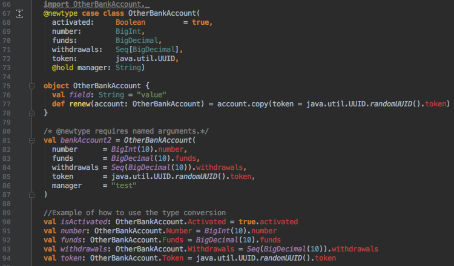

## Dilate

[](https://travis-ci.org/vitorsvieira/dilate)
[](LICENSE)

### Overview
Dilate provides macro annotations that generates value classes and unboxed tagged types at compile-time for extra type-safety focusing on nearly zero runtime overhead.
Value classes and tagged types have an important role when developing high performance Scala applications.

This project proudly uses [scalameta](https://github.com/scalameta/scalameta).

### Motivation

  - Type-safety and type checking
  - Avoid runtime object allocation
  - Zero syntactical and bytecode overhead

### Getting Started

To get started with SBT, simply add the following to your `build.sbt` file:

```scala
libraryDependencies += "com.vitorsvieira" %% "dilate" % "0.1.1"

resolvers += Resolver.bintrayIvyRepo("scalameta", "maven")

// A dependency on macro paradise is required to both write and expand
// new-style macros.  This is similar to how it works for old-style macro
// annotations and a dependency on macro paradise 2.x.
addCompilerPlugin("org.scalameta" % "paradise" % "3.0.0-beta4" cross CrossVersion.full)

scalacOptions += "-Xplugin-require:macroparadise"
```

### Examples

### @valueclass

Applying `@valueclass` to the `BankAccount` class as below:

```scala
@valueclass case class BankAccount(
    number:      BigInt          = 10,
    funds:       BigDecimal,
    withdrawals: Seq[BigDecimal],
    token:       java.util.UUID) {

  def methodA = number * 1000
}

object BankAccount {
  def renew(account: BankAccount) = account.copy(token = java.util.UUID.randomUUID())
}
```

Allows `BankAccount` to be instantiated using the new types as: 

```scala
val account = BankAccount(
  BankAccount.Number(1234),
  BankAccount.Funds(10),
  BankAccount.Withdrawals(Seq(1000)),
  BankAccount.Token(java.util.UUID.randomUUID())
)
```

The above construction is possible as the following types(value classes) and implicit conversions are generated at compile-time.

```scala
case class BankAccount(
  number:      BankAccount.Number = BankAccount.Number(10),
  funds:       BankAccount.Funds,
  withdrawals: BankAccount.Withdrawals,
  token:       BankAccount.Token) { 
  def methodA = number * 1000 
}
object BankAccount {
  final case class Number(self: BigInt) extends AnyVal
  final case class Funds(self: BigDecimal) extends AnyVal
  final case class Withdrawals(self: _root_.scala.collection.Seq[BigDecimal]) extends AnyVal
  final case class Token(self: java.util.UUID) extends AnyVal
  
  private[this] implicit def toNumber(number: BigInt): BankAccount.Number = BankAccount.Number(number)
  implicit def toBigIntfromNumber(number: Number): BigInt = number.self
  
  private[this] implicit def toFunds(funds: BigDecimal): BankAccount.Funds = BankAccount.Funds(funds)
  implicit def toBigDecimalfromFunds(funds: Funds): BigDecimal = funds.self
  
  private[this] implicit def toWithdrawals(withdrawals: Seq[BigDecimal]): BankAccount.Withdrawals = BankAccount.Withdrawals(withdrawals)
  implicit def toSeqBigDecimalfromWithdrawals(withdrawals: Withdrawals): Seq[BigDecimal] = withdrawals.self
  
  private[this] implicit def toToken(token: java.util.UUID): BankAccount.Token = BankAccount.Token(token)
  implicit def tojavautilUUIDfromToken(token: Token): java.util.UUID = token.self
  
  def renew(account: BankAccount) = account.copy(token = java.util.UUID.randomUUID())
}
```

### @valueclass with @hold

`@hold` allows keeping the type without any modification. Applying `@valueclass` to the `Person` class as below:

```scala
case class Age(value: Int) extends AnyVal

@valueclass final class Person(
  v1:           Boolean,
  @hold v2:     Age                 = Age(1),//will hold Age as is
  v3:           Int                 = 1,
  v4:           Int,
  bankAccount: BankAccount.Number)
```

Generates the following types as value classes, and implicit conversions at compile-time.

```scala
sealed class Person(
  v1:          Person.V1,
  v2:          Age          = Age(1),        //held the type Age from the above value class 
  v3:          Person.V3    = Person.V3(1),
  v4:          Person.V4,
  bankAccount: BankAccount.Number)
  
object Person {
  final case class V1(self: Boolean) extends AnyVal
  final case class V3(self: Int) extends AnyVal
  final case class V4(self: Int) extends AnyVal
  
  private[this] implicit def toV1(v1: Boolean): Person.V1 = Person.V1(v1)
  implicit def toBooleanfromV1(v1: V1): Boolean = v1.self
  
  private[this] implicit def toV3(v3: Int): Person.V3 = Person.V3(v3)
  implicit def toIntfromV3(v3: V3): Int = v3.self
  
  private[this] implicit def toV4(v4: Int): Person.V4 = Person.V4(v4)
  implicit def toIntfromV4(v4: V4): Int = v4.self
}
```

### @newtype

Applying `@newtype` to the `BankAccount` class as below:

```scala
import BankAccount._
@newtype case class BankAccount(
  activated:     Boolean           = true,
  number:        BigInt,
  funds:         BigDecimal,
  withdrawals:   Seq[BigDecimal],
  token:         java.util.UUID,
  @hold manager: String)
```

Allows `BankAccount` to be created like:

```scala
val bankAccount2 = OtherBankAccount(
  number      = BigInt(10).number,
  funds       = BigDecimal(10).funds,
  withdrawals = Seq(BigDecimal(10)).withdrawals,
  token       = java.util.UUID.randomUUID().token,
  manager     = "test"
)
```
Due to current limitations in the [whiteboxing](http://docs.scala-lang.org/overviews/macros/blackbox-whitebox.html) architecture, only when using `@newtype` macro, the construction must have named arguments.


The above construction is possible as the following `Unboxed Tagged Types` and implicit classes are generated at compile-time.

```scala
import BankAccount._
case class BankAccount(
  activated:   BankAccount.Activated   = true.activated,
  number:      BankAccount.Number, 
  funds:       BankAccount.Funds,
  withdrawals: BankAccount.Withdrawals,
  token:       BankAccount.Token,
  manager:     String)
  
object BankAccount {
  trait ActivatedTag
  trait NumberTag
  trait FundsTag
  trait WithdrawalsTag
  trait TokenTag
  
  type Activated   = Boolean         @@ ActivatedTag
  type Number      = BigInt          @@ NumberTag
  type Funds       = BigDecimal      @@ FundsTag
  type Withdrawals = Seq[BigDecimal] @@ WithdrawalsTag
  type Token       = java.util.UUID  @@ TokenTag
  
  implicit class TaggedBoolean(val value: Boolean) extends AnyVal { 
    def activated: Activated = value.asInstanceOf[Activated] 
  }
  implicit class TaggedBigInt(val value: BigInt) extends AnyVal { 
    def number: Number = value.asInstanceOf[Number] 
  }
  implicit class TaggedBigDecimal(val value: BigDecimal) extends AnyVal { 
    def funds: Funds = value.asInstanceOf[Funds] 
  }
  implicit class TaggedSeqBigDecimal(val value: Seq[BigDecimal]) extends AnyVal { 
    def withdrawals: Withdrawals = value.asInstanceOf[Withdrawals] 
  }
  implicit class TaggedjavautilUUID(val value: java.util.UUID) extends AnyVal { 
    def token: Token = value.asInstanceOf[Token] 
  }
}
```

Note that in the example above `import BankAccount._` is presented. 
This is required only when using `@newtype` annotation and specially for classes with default values and/or companion objects with values looking for implicit conversion.
This is required due to current limitations on macro whiteboxing.

All the examples above are available in the `examples` folder.

### Bytecode Analysis

Using `javap -p BankAccountWithoutMacro\$ BankAccountWithValueclass\$ BankAccountWithNewtype\$` to disassemble and see the bytecode generated with and without the macros, 
the following output shows the intended types being used!

#### Without any macro
```scala
Warning: Binary file BankAccountWithoutMacro$ contains com.vitorsvieira.dilate.BankAccountWithoutMacro$
Compiled from "Examples.scala"
public final class com.vitorsvieira.dilate.BankAccountWithoutMacro$ implements scala.Serializable {
  public static final com.vitorsvieira.dilate.BankAccountWithoutMacro$ MODULE$;

  private final java.lang.String field;

  private volatile boolean bitmap$init$0;

  public static {};
    Code:
       0: new           #2                  // class com/vitorsvieira/dilate/BankAccountWithoutMacro$
       3: invokespecial #14                 // Method "<init>":()V
       6: return

  public java.lang.String field();
    Code:
       0: aload_0
       1: getfield      #21                 // Field bitmap$init$0:Z
       4: ifeq          17
       7: aload_0
       8: getfield      #23                 // Field field:Ljava/lang/String;
      11: pop
      12: aload_0
      13: getfield      #23                 // Field field:Ljava/lang/String;
      16: areturn
      17: new           #25                 // class scala/UninitializedFieldError
      20: dup
      21: ldc           #27                 // String Uninitialized field: Examples.scala: 85
      23: invokespecial #30                 // Method scala/UninitializedFieldError."<init>":(Ljava/lang/String;)V
      26: athrow
    LineNumberTable:
      line 85: 0
    LocalVariableTable:
      Start  Length  Slot  Name   Signature
          0      27     0  this   Lcom/vitorsvieira/dilate/BankAccountWithoutMacro$;

  public com.vitorsvieira.dilate.BankAccountWithoutMacro renew(com.vitorsvieira.dilate.BankAccountWithoutMacro);
    Code:
       0: invokestatic  #39                 // Method java/util/UUID.randomUUID:()Ljava/util/UUID;
       3: astore_2
       4: aload_1
       5: invokevirtual #45                 // Method com/vitorsvieira/dilate/BankAccountWithoutMacro.copy$default$1:()Z
       8: istore_3
       9: aload_1
      10: invokevirtual #49                 // Method com/vitorsvieira/dilate/BankAccountWithoutMacro.copy$default$2:()Lscala/math/BigInt;
      13: astore        4
      15: aload_1
      16: invokevirtual #53                 // Method com/vitorsvieira/dilate/BankAccountWithoutMacro.copy$default$3:()Lscala/math/BigDecimal;
      19: astore        5
      21: aload_1
      22: invokevirtual #57                 // Method com/vitorsvieira/dilate/BankAccountWithoutMacro.copy$default$4:()Lscala/collection/Seq;
      25: astore        6
      27: aload_1
      28: invokevirtual #60                 // Method com/vitorsvieira/dilate/BankAccountWithoutMacro.copy$default$6:()Ljava/lang/String;
      31: astore        7
      33: aload_1
      34: iload_3
      35: aload         4
      37: aload         5
      39: aload         6
      41: aload_2
      42: aload         7
      44: invokevirtual #64                 // Method com/vitorsvieira/dilate/BankAccountWithoutMacro.copy:(ZLscala/math/BigInt;Lscala/math/BigDecimal;Lscala/collection/Seq;Ljava/util/UUID;Ljava/lang/String;)Lcom/vitorsvieira/dilate/BankAccountWithoutMacro;
      47: areturn
    LineNumberTable:
      line 87: 0
    LocalVariableTable:
      Start  Length  Slot  Name   Signature
          0      48     0  this   Lcom/vitorsvieira/dilate/BankAccountWithoutMacro$;
          0      48     1 bankAccount   Lcom/vitorsvieira/dilate/BankAccountWithoutMacro;
          4      43     2  x$13   Ljava/util/UUID;
          9      38     3  x$14   Z
         15      32     4  x$15   Lscala/math/BigInt;
         21      26     5  x$16   Lscala/math/BigDecimal;
         27      20     6  x$17   Lscala/collection/Seq;
         33      14     7  x$18   Ljava/lang/String;

  public com.vitorsvieira.dilate.BankAccountWithoutMacro apply(boolean, scala.math.BigInt, scala.math.BigDecimal, scala.collection.Seq<scala.math.BigDecimal>, java.util.UUID, java.lang.String);
    Code:
       0: new           #41                 // class com/vitorsvieira/dilate/BankAccountWithoutMacro
       3: dup
       4: iload_1
       5: aload_2
       6: aload_3
       7: aload         4
       9: aload         5
      11: aload         6
      13: invokespecial #80                 // Method com/vitorsvieira/dilate/BankAccountWithoutMacro."<init>":(ZLscala/math/BigInt;Lscala/math/BigDecimal;Lscala/collection/Seq;Ljava/util/UUID;Ljava/lang/String;)V
      16: areturn
    LineNumberTable:
      line 71: 0
    LocalVariableTable:
      Start  Length  Slot  Name   Signature
          0      17     0  this   Lcom/vitorsvieira/dilate/BankAccountWithoutMacro$;
          0      17     1 activated   Z
          0      17     2 number   Lscala/math/BigInt;
          0      17     3 funds   Lscala/math/BigDecimal;
          0      17     4 withdrawals   Lscala/collection/Seq;
          0      17     5 token   Ljava/util/UUID;
          0      17     6 manager   Ljava/lang/String;

  public scala.Option<scala.Tuple6<java.lang.Object, scala.math.BigInt, scala.math.BigDecimal, scala.collection.Seq<scala.math.BigDecimal>, java.util.UUID, java.lang.String>> unapply(com.vitorsvieira.dilate.BankAccountWithoutMacro);
    Code:
       0: aload_1
       1: ifnonnull     10
       4: getstatic     #93                 // Field scala/None$.MODULE$:Lscala/None$;
       7: goto          51
      10: new           #95                 // class scala/Some
      13: dup
      14: new           #97                 // class scala/Tuple6
      17: dup
      18: aload_1
      19: invokevirtual #99                 // Method com/vitorsvieira/dilate/BankAccountWithoutMacro.activated:()Z
      22: invokestatic  #105                // Method scala/runtime/BoxesRunTime.boxToBoolean:(Z)Ljava/lang/Boolean;
      25: aload_1
      26: invokevirtual #107                // Method com/vitorsvieira/dilate/BankAccountWithoutMacro.number:()Lscala/math/BigInt;
      29: aload_1
      30: invokevirtual #109                // Method com/vitorsvieira/dilate/BankAccountWithoutMacro.funds:()Lscala/math/BigDecimal;
      33: aload_1
      34: invokevirtual #111                // Method com/vitorsvieira/dilate/BankAccountWithoutMacro.withdrawals:()Lscala/collection/Seq;
      37: aload_1
      38: invokevirtual #113                // Method com/vitorsvieira/dilate/BankAccountWithoutMacro.token:()Ljava/util/UUID;
      41: aload_1
      42: invokevirtual #115                // Method com/vitorsvieira/dilate/BankAccountWithoutMacro.manager:()Ljava/lang/String;
      45: invokespecial #118                // Method scala/Tuple6."<init>":(Ljava/lang/Object;Ljava/lang/Object;Ljava/lang/Object;Ljava/lang/Object;Ljava/lang/Object;Ljava/lang/Object;)V
      48: invokespecial #121                // Method scala/Some."<init>":(Ljava/lang/Object;)V
      51: areturn
    LineNumberTable:
      line 71: 0
    LocalVariableTable:
      Start  Length  Slot  Name   Signature
          0      52     0  this   Lcom/vitorsvieira/dilate/BankAccountWithoutMacro$;
          0      52     1   x$0   Lcom/vitorsvieira/dilate/BankAccountWithoutMacro;

  public boolean $lessinit$greater$default$1();
    Code:
       0: iconst_1
       1: ireturn
    LineNumberTable:
      line 72: 0
    LocalVariableTable:
      Start  Length  Slot  Name   Signature
          0       2     0  this   Lcom/vitorsvieira/dilate/BankAccountWithoutMacro$;

  public boolean apply$default$1();
    Code:
       0: iconst_1
       1: ireturn
    LineNumberTable:
      line 72: 0
    LocalVariableTable:
      Start  Length  Slot  Name   Signature
          0       2     0  this   Lcom/vitorsvieira/dilate/BankAccountWithoutMacro$;

  private java.lang.Object readResolve();
    Code:
       0: getstatic     #130                // Field MODULE$:Lcom/vitorsvieira/dilate/BankAccountWithoutMacro$;
       3: areturn
    LineNumberTable:
      line 83: 0
    LocalVariableTable:
      Start  Length  Slot  Name   Signature
          0       4     0  this   Lcom/vitorsvieira/dilate/BankAccountWithoutMacro$;

  private com.vitorsvieira.dilate.BankAccountWithoutMacro$();
    Code:
       0: aload_0
       1: invokespecial #131                // Method java/lang/Object."<init>":()V
       4: aload_0
       5: putstatic     #130                // Field MODULE$:Lcom/vitorsvieira/dilate/BankAccountWithoutMacro$;
       8: aload_0
       9: ldc           #133                // String value
      11: putfield      #23                 // Field field:Ljava/lang/String;
      14: aload_0
      15: iconst_1
      16: putfield      #21                 // Field bitmap$init$0:Z
      19: return
    LineNumberTable:
      line 101: 0
      line 85: 8
    LocalVariableTable:
      Start  Length  Slot  Name   Signature
          0      20     0  this   Lcom/vitorsvieira/dilate/BankAccountWithoutMacro$;
}
```

#### bytecode generated with @valueclass

```scala
Warning: Binary file BankAccountWithValueclass$ contains com.vitorsvieira.dilate.BankAccountWithValueclass$
Compiled from "Examples.scala"
public final class com.vitorsvieira.dilate.BankAccountWithValueclass$ implements scala.Serializable {
  public static final com.vitorsvieira.dilate.BankAccountWithValueclass$ MODULE$;

  private final java.lang.String field;

  private volatile boolean bitmap$init$0;

  public static {};
    Code:
       0: new           #2                  // class com/vitorsvieira/dilate/BankAccountWithValueclass$
       3: invokespecial #14                 // Method "<init>":()V
       6: return

  private boolean toActivated(boolean);
    Code:
       0: iload_1
       1: ireturn
    LineNumberTable:
      line 12: 0
    LocalVariableTable:
      Start  Length  Slot  Name   Signature
          0       2     0  this   Lcom/vitorsvieira/dilate/BankAccountWithValueclass$;
          0       2     1 activated   Z

  public boolean toBooleanfromActivated(boolean);
    Code:
       0: iload_1
       1: ireturn
    LineNumberTable:
      line 13: 0
    LocalVariableTable:
      Start  Length  Slot  Name   Signature
          0       2     0  this   Lcom/vitorsvieira/dilate/BankAccountWithValueclass$;
          0       2     1 activated   Z

  private scala.math.BigInt toNumber(scala.math.BigInt);
    Code:
       0: aload_1
       1: areturn
    LineNumberTable:
      line 14: 0
    LocalVariableTable:
      Start  Length  Slot  Name   Signature
          0       2     0  this   Lcom/vitorsvieira/dilate/BankAccountWithValueclass$;
          0       2     1 number   Lscala/math/BigInt;

  public scala.math.BigInt toBigIntfromNumber(scala.math.BigInt);
    Code:
       0: aload_1
       1: areturn
    LineNumberTable:
      line 15: 0
    LocalVariableTable:
      Start  Length  Slot  Name   Signature
          0       2     0  this   Lcom/vitorsvieira/dilate/BankAccountWithValueclass$;
          0       2     1 number   Lscala/math/BigInt;

  private scala.math.BigDecimal toFunds(scala.math.BigDecimal);
    Code:
       0: aload_1
       1: areturn
    LineNumberTable:
      line 16: 0
    LocalVariableTable:
      Start  Length  Slot  Name   Signature
          0       2     0  this   Lcom/vitorsvieira/dilate/BankAccountWithValueclass$;
          0       2     1 funds   Lscala/math/BigDecimal;

  public scala.math.BigDecimal toBigDecimalfromFunds(scala.math.BigDecimal);
    Code:
       0: aload_1
       1: areturn
    LineNumberTable:
      line 17: 0
    LocalVariableTable:
      Start  Length  Slot  Name   Signature
          0       2     0  this   Lcom/vitorsvieira/dilate/BankAccountWithValueclass$;
          0       2     1 funds   Lscala/math/BigDecimal;

  private scala.collection.Seq<scala.math.BigDecimal> toWithdrawals(scala.collection.Seq<scala.math.BigDecimal>);
    Code:
       0: aload_1
       1: areturn
    LineNumberTable:
      line 18: 0
    LocalVariableTable:
      Start  Length  Slot  Name   Signature
          0       2     0  this   Lcom/vitorsvieira/dilate/BankAccountWithValueclass$;
          0       2     1 withdrawals   Lscala/collection/Seq;

  public scala.collection.Seq<scala.math.BigDecimal> toSeqBigDecimalfromWithdrawals(scala.collection.Seq<scala.math.BigDecimal>);
    Code:
       0: aload_1
       1: areturn
    LineNumberTable:
      line 19: 0
    LocalVariableTable:
      Start  Length  Slot  Name   Signature
          0       2     0  this   Lcom/vitorsvieira/dilate/BankAccountWithValueclass$;
          0       2     1 withdrawals   Lscala/collection/Seq;

  private java.util.UUID toToken(java.util.UUID);
    Code:
       0: aload_1
       1: areturn
    LineNumberTable:
      line 20: 0
    LocalVariableTable:
      Start  Length  Slot  Name   Signature
          0       2     0  this   Lcom/vitorsvieira/dilate/BankAccountWithValueclass$;
          0       2     1 token   Ljava/util/UUID;

  public java.util.UUID tojavautilUUIDfromToken(java.util.UUID);
    Code:
       0: aload_1
       1: areturn
    LineNumberTable:
      line 21: 0
    LocalVariableTable:
      Start  Length  Slot  Name   Signature
          0       2     0  this   Lcom/vitorsvieira/dilate/BankAccountWithValueclass$;
          0       2     1 token   Ljava/util/UUID;

  public java.lang.String field();
    Code:
       0: aload_0
       1: getfield      #46                 // Field bitmap$init$0:Z
       4: ifeq          17
       7: aload_0
       8: getfield      #48                 // Field field:Ljava/lang/String;
      11: pop
      12: aload_0
      13: getfield      #48                 // Field field:Ljava/lang/String;
      16: areturn
      17: new           #50                 // class scala/UninitializedFieldError
      20: dup
      21: ldc           #52                 // String Uninitialized field: Examples.scala: 22
      23: invokespecial #55                 // Method scala/UninitializedFieldError."<init>":(Ljava/lang/String;)V
      26: athrow
    LineNumberTable:
      line 22: 0
    LocalVariableTable:
      Start  Length  Slot  Name   Signature
          0      27     0  this   Lcom/vitorsvieira/dilate/BankAccountWithValueclass$;

  public com.vitorsvieira.dilate.BankAccountWithValueclass renew(com.vitorsvieira.dilate.BankAccountWithValueclass);
    Code:
       0: aload_0
       1: invokestatic  #63                 // Method java/util/UUID.randomUUID:()Ljava/util/UUID;
       4: invokespecial #65                 // Method toToken:(Ljava/util/UUID;)Ljava/util/UUID;
       7: astore_2
       8: aload_1
       9: invokevirtual #71                 // Method com/vitorsvieira/dilate/BankAccountWithValueclass.copy$default$1:()Z
      12: istore_3
      13: aload_1
      14: invokevirtual #75                 // Method com/vitorsvieira/dilate/BankAccountWithValueclass.copy$default$2:()Lscala/math/BigInt;
      17: astore        4
      19: aload_1
      20: invokevirtual #79                 // Method com/vitorsvieira/dilate/BankAccountWithValueclass.copy$default$3:()Lscala/math/BigDecimal;
      23: astore        5
      25: aload_1
      26: invokevirtual #83                 // Method com/vitorsvieira/dilate/BankAccountWithValueclass.copy$default$4:()Lscala/collection/Seq;
      29: astore        6
      31: aload_1
      32: invokevirtual #86                 // Method com/vitorsvieira/dilate/BankAccountWithValueclass.copy$default$6:()Ljava/lang/String;
      35: astore        7
      37: aload_1
      38: iload_3
      39: aload         4
      41: aload         5
      43: aload         6
      45: aload_2
      46: aload         7
      48: invokevirtual #90                 // Method com/vitorsvieira/dilate/BankAccountWithValueclass.copy:(ZLscala/math/BigInt;Lscala/math/BigDecimal;Lscala/collection/Seq;Ljava/util/UUID;Ljava/lang/String;)Lcom/vitorsvieira/dilate/BankAccountWithValueclass;
      51: areturn
    LineNumberTable:
      line 23: 0
    LocalVariableTable:
      Start  Length  Slot  Name   Signature
          0      52     0  this   Lcom/vitorsvieira/dilate/BankAccountWithValueclass$;
          0      52     1 bankAccount   Lcom/vitorsvieira/dilate/BankAccountWithValueclass;
          8      43     2   x$1   Ljava/util/UUID;
         13      38     3   x$2   Z
         19      32     4   x$3   Lscala/math/BigInt;
         25      26     5   x$4   Lscala/math/BigDecimal;
         31      20     6   x$5   Lscala/collection/Seq;
         37      14     7   x$6   Ljava/lang/String;

  public com.vitorsvieira.dilate.BankAccountWithValueclass apply(boolean, scala.math.BigInt, scala.math.BigDecimal, scala.collection.Seq, java.util.UUID, java.lang.String);
    Code:
       0: new           #67                 // class com/vitorsvieira/dilate/BankAccountWithValueclass
       3: dup
       4: iload_1
       5: aload_2
       6: aload_3
       7: aload         4
       9: aload         5
      11: aload         6
      13: invokespecial #102                // Method com/vitorsvieira/dilate/BankAccountWithValueclass."<init>":(ZLscala/math/BigInt;Lscala/math/BigDecimal;Lscala/collection/Seq;Ljava/util/UUID;Ljava/lang/String;)V
      16: areturn
    LineNumberTable:
      line 2: 0
    LocalVariableTable:
      Start  Length  Slot  Name   Signature
          0      17     0  this   Lcom/vitorsvieira/dilate/BankAccountWithValueclass$;
          0      17     1 activated   Z
          0      17     2 number   Lscala/math/BigInt;
          0      17     3 funds   Lscala/math/BigDecimal;
          0      17     4 withdrawals   Lscala/collection/Seq;
          0      17     5 token   Ljava/util/UUID;
          0      17     6 manager   Ljava/lang/String;

  public scala.Option<scala.Tuple6<com.vitorsvieira.dilate.BankAccountWithValueclass$Activated, scala.math.BigInt, scala.math.BigDecimal, scala.collection.Seq<scala.math.BigDecimal>, java.util.UUID, java.lang.String>> unapply(com.vitorsvieira.dilate.BankAccountWithValueclass);
    Code:
       0: aload_1
       1: ifnonnull     10
       4: getstatic     #110                // Field scala/None$.MODULE$:Lscala/None$;
       7: goto          83
      10: new           #112                // class scala/Some
      13: dup
      14: new           #114                // class scala/Tuple6
      17: dup
      18: new           #116                // class com/vitorsvieira/dilate/BankAccountWithValueclass$Activated
      21: dup
      22: aload_1
      23: invokevirtual #118                // Method com/vitorsvieira/dilate/BankAccountWithValueclass.activated:()Z
      26: invokespecial #121                // Method com/vitorsvieira/dilate/BankAccountWithValueclass$Activated."<init>":(Z)V
      29: new           #123                // class com/vitorsvieira/dilate/BankAccountWithValueclass$Number
      32: dup
      33: aload_1
      34: invokevirtual #125                // Method com/vitorsvieira/dilate/BankAccountWithValueclass.number:()Lscala/math/BigInt;
      37: invokespecial #128                // Method com/vitorsvieira/dilate/BankAccountWithValueclass$Number."<init>":(Lscala/math/BigInt;)V
      40: new           #130                // class com/vitorsvieira/dilate/BankAccountWithValueclass$Funds
      43: dup
      44: aload_1
      45: invokevirtual #132                // Method com/vitorsvieira/dilate/BankAccountWithValueclass.funds:()Lscala/math/BigDecimal;
      48: invokespecial #135                // Method com/vitorsvieira/dilate/BankAccountWithValueclass$Funds."<init>":(Lscala/math/BigDecimal;)V
      51: new           #137                // class com/vitorsvieira/dilate/BankAccountWithValueclass$Withdrawals
      54: dup
      55: aload_1
      56: invokevirtual #139                // Method com/vitorsvieira/dilate/BankAccountWithValueclass.withdrawals:()Lscala/collection/Seq;
      59: invokespecial #142                // Method com/vitorsvieira/dilate/BankAccountWithValueclass$Withdrawals."<init>":(Lscala/collection/Seq;)V
      62: new           #144                // class com/vitorsvieira/dilate/BankAccountWithValueclass$Token
      65: dup
      66: aload_1
      67: invokevirtual #146                // Method com/vitorsvieira/dilate/BankAccountWithValueclass.token:()Ljava/util/UUID;
      70: invokespecial #149                // Method com/vitorsvieira/dilate/BankAccountWithValueclass$Token."<init>":(Ljava/util/UUID;)V
      73: aload_1
      74: invokevirtual #151                // Method com/vitorsvieira/dilate/BankAccountWithValueclass.manager:()Ljava/lang/String;
      77: invokespecial #154                // Method scala/Tuple6."<init>":(Ljava/lang/Object;Ljava/lang/Object;Ljava/lang/Object;Ljava/lang/Object;Ljava/lang/Object;Ljava/lang/Object;)V
      80: invokespecial #157                // Method scala/Some."<init>":(Ljava/lang/Object;)V
      83: areturn
    LineNumberTable:
      line 2: 0
    LocalVariableTable:
      Start  Length  Slot  Name   Signature
          0      84     0  this   Lcom/vitorsvieira/dilate/BankAccountWithValueclass$;
          0      84     1   x$0   Lcom/vitorsvieira/dilate/BankAccountWithValueclass;

  public boolean $lessinit$greater$default$1();
    Code:
       0: iconst_1
       1: ireturn
    LineNumberTable:
      line 2: 0
    LocalVariableTable:
      Start  Length  Slot  Name   Signature
          0       2     0  this   Lcom/vitorsvieira/dilate/BankAccountWithValueclass$;

  public boolean apply$default$1();
    Code:
       0: iconst_1
       1: ireturn
    LineNumberTable:
      line 2: 0
    LocalVariableTable:
      Start  Length  Slot  Name   Signature
          0       2     0  this   Lcom/vitorsvieira/dilate/BankAccountWithValueclass$;

  private java.lang.Object readResolve();
    Code:
       0: getstatic     #166                // Field MODULE$:Lcom/vitorsvieira/dilate/BankAccountWithValueclass$;
       3: areturn
    LineNumberTable:
      line 6: 0
    LocalVariableTable:
      Start  Length  Slot  Name   Signature
          0       4     0  this   Lcom/vitorsvieira/dilate/BankAccountWithValueclass$;

  private com.vitorsvieira.dilate.BankAccountWithValueclass$();
    Code:
       0: aload_0
       1: invokespecial #167                // Method java/lang/Object."<init>":()V
       4: aload_0
       5: putstatic     #166                // Field MODULE$:Lcom/vitorsvieira/dilate/BankAccountWithValueclass$;
       8: aload_0
       9: ldc           #169                // String value
      11: putfield      #48                 // Field field:Ljava/lang/String;
      14: aload_0
      15: iconst_1
      16: putfield      #46                 // Field bitmap$init$0:Z
      19: return
    LineNumberTable:
      line 25: 0
      line 22: 8
    LocalVariableTable:
      Start  Length  Slot  Name   Signature
          0      20     0  this   Lcom/vitorsvieira/dilate/BankAccountWithValueclass$;
}
```

#### bytecode generated with @newtype

```scala
Warning: Binary file BankAccountWithNewtype$ contains com.vitorsvieira.dilate.BankAccountWithNewtype$
Compiled from "Examples.scala"
public final class com.vitorsvieira.dilate.BankAccountWithNewtype$ implements scala.Serializable {
  public static final com.vitorsvieira.dilate.BankAccountWithNewtype$ MODULE$;

  private final java.lang.String field;

  private volatile boolean bitmap$init$0;

  public static {};
    Code:
       0: new           #2                  // class com/vitorsvieira/dilate/BankAccountWithNewtype$
       3: invokespecial #14                 // Method "<init>":()V
       6: return

  public boolean TaggedBoolean(boolean);
    Code:
       0: iload_1
       1: ireturn
    LineNumberTable:
      line 14: 0
    LocalVariableTable:
      Start  Length  Slot  Name   Signature
          0       2     0  this   Lcom/vitorsvieira/dilate/BankAccountWithNewtype$;
          0       2     1 value   Z

  public scala.math.BigInt TaggedBigInt(scala.math.BigInt);
    Code:
       0: aload_1
       1: areturn
    LineNumberTable:
      line 15: 0
    LocalVariableTable:
      Start  Length  Slot  Name   Signature
          0       2     0  this   Lcom/vitorsvieira/dilate/BankAccountWithNewtype$;
          0       2     1 value   Lscala/math/BigInt;

  public scala.math.BigDecimal TaggedBigDecimal(scala.math.BigDecimal);
    Code:
       0: aload_1
       1: areturn
    LineNumberTable:
      line 16: 0
    LocalVariableTable:
      Start  Length  Slot  Name   Signature
          0       2     0  this   Lcom/vitorsvieira/dilate/BankAccountWithNewtype$;
          0       2     1 value   Lscala/math/BigDecimal;

  public scala.collection.Seq<scala.math.BigDecimal> TaggedSeqBigDecimal(scala.collection.Seq<scala.math.BigDecimal>);
    Code:
       0: aload_1
       1: areturn
    LineNumberTable:
      line 17: 0
    LocalVariableTable:
      Start  Length  Slot  Name   Signature
          0       2     0  this   Lcom/vitorsvieira/dilate/BankAccountWithNewtype$;
          0       2     1 value   Lscala/collection/Seq;

  public java.util.UUID TaggedjavautilUUID(java.util.UUID);
    Code:
       0: aload_1
       1: areturn
    LineNumberTable:
      line 18: 0
    LocalVariableTable:
      Start  Length  Slot  Name   Signature
          0       2     0  this   Lcom/vitorsvieira/dilate/BankAccountWithNewtype$;
          0       2     1 value   Ljava/util/UUID;

  public java.lang.String field();
    Code:
       0: aload_0
       1: getfield      #37                 // Field bitmap$init$0:Z
       4: ifeq          17
       7: aload_0
       8: getfield      #39                 // Field field:Ljava/lang/String;
      11: pop
      12: aload_0
      13: getfield      #39                 // Field field:Ljava/lang/String;
      16: areturn
      17: new           #41                 // class scala/UninitializedFieldError
      20: dup
      21: ldc           #43                 // String Uninitialized field: Examples.scala: 19
      23: invokespecial #46                 // Method scala/UninitializedFieldError."<init>":(Ljava/lang/String;)V
      26: athrow
    LineNumberTable:
      line 19: 0
    LocalVariableTable:
      Start  Length  Slot  Name   Signature
          0      27     0  this   Lcom/vitorsvieira/dilate/BankAccountWithNewtype$;

  public com.vitorsvieira.dilate.BankAccountWithNewtype renew(com.vitorsvieira.dilate.BankAccountWithNewtype);
    Code:
       0: getstatic     #53                 // Field com/vitorsvieira/dilate/BankAccountWithNewtype$TaggedjavautilUUID$.MODULE$:Lcom/vitorsvieira/dilate/BankAccountWithNewtype$TaggedjavautilUUID$;
       3: aload_0
       4: invokestatic  #59                 // Method java/util/UUID.randomUUID:()Ljava/util/UUID;
       7: invokevirtual #61                 // Method TaggedjavautilUUID:(Ljava/util/UUID;)Ljava/util/UUID;
      10: invokevirtual #64                 // Method com/vitorsvieira/dilate/BankAccountWithNewtype$TaggedjavautilUUID$.token$extension:(Ljava/util/UUID;)Ljava/util/UUID;
      13: astore_2
      14: aload_1
      15: invokevirtual #70                 // Method com/vitorsvieira/dilate/BankAccountWithNewtype.copy$default$1:()Z
      18: istore_3
      19: aload_1
      20: invokevirtual #74                 // Method com/vitorsvieira/dilate/BankAccountWithNewtype.copy$default$2:()Lscala/math/BigInt;
      23: astore        4
      25: aload_1
      26: invokevirtual #78                 // Method com/vitorsvieira/dilate/BankAccountWithNewtype.copy$default$3:()Lscala/math/BigDecimal;
      29: astore        5
      31: aload_1
      32: invokevirtual #82                 // Method com/vitorsvieira/dilate/BankAccountWithNewtype.copy$default$4:()Ljava/lang/Object;
      35: astore        6
      37: aload_1
      38: invokevirtual #85                 // Method com/vitorsvieira/dilate/BankAccountWithNewtype.copy$default$6:()Ljava/lang/String;
      41: astore        7
      43: aload_1
      44: iload_3
      45: aload         4
      47: aload         5
      49: aload         6
      51: aload_2
      52: aload         7
      54: invokevirtual #89                 // Method com/vitorsvieira/dilate/BankAccountWithNewtype.copy:(ZLscala/math/BigInt;Lscala/math/BigDecimal;Ljava/lang/Object;Ljava/util/UUID;Ljava/lang/String;)Lcom/vitorsvieira/dilate/BankAccountWithNewtype;
      57: areturn
    LineNumberTable:
      line 20: 3
    LocalVariableTable:
      Start  Length  Slot  Name   Signature
          0      58     0  this   Lcom/vitorsvieira/dilate/BankAccountWithNewtype$;
          0      58     1 account   Lcom/vitorsvieira/dilate/BankAccountWithNewtype;
         14      43     2   x$7   Ljava/util/UUID;
         19      38     3   x$8   Z
         25      32     4   x$9   Lscala/math/BigInt;
         31      26     5  x$10   Lscala/math/BigDecimal;
         37      20     6  x$11   Ljava/lang/Object;
         43      14     7  x$12   Ljava/lang/String;

  public com.vitorsvieira.dilate.BankAccountWithNewtype apply(java.lang.Object, scala.math.BigInt, scala.math.BigDecimal, scala.collection.Seq<scala.math.BigDecimal>, java.util.UUID, java.lang.String);
    Code:
       0: new           #66                 // class com/vitorsvieira/dilate/BankAccountWithNewtype
       3: dup
       4: iload_1
       5: aload_2
       6: aload_3
       7: aload         4
       9: aload         5
      11: aload         6
      13: invokespecial #102                // Method com/vitorsvieira/dilate/BankAccountWithNewtype."<init>":(ZLscala/math/BigInt;Lscala/math/BigDecimal;Ljava/lang/Object;Ljava/util/UUID;Ljava/lang/String;)V
      16: areturn
    LineNumberTable:
      line 2: 0
    LocalVariableTable:
      Start  Length  Slot  Name   Signature
          0      17     0  this   Lcom/vitorsvieira/dilate/BankAccountWithNewtype$;
          0      17     1 activated   Z
          0      17     2 number   Lscala/math/BigInt;
          0      17     3 funds   Lscala/math/BigDecimal;
          0      17     4 withdrawals   Ljava/lang/Object;
          0      17     5 token   Ljava/util/UUID;
          0      17     6 manager   Ljava/lang/String;

  public scala.Option<scala.Tuple6<java.lang.Object, scala.math.BigInt, scala.math.BigDecimal, scala.collection.Seq<scala.math.BigDecimal>, java.util.UUID, java.lang.String>> unapply(com.vitorsvieira.dilate.BankAccountWithNewtype);
    Code:
       0: aload_1
       1: ifnonnull     10
       4: getstatic     #115                // Field scala/None$.MODULE$:Lscala/None$;
       7: goto          51
      10: new           #117                // class scala/Some
      13: dup
      14: new           #119                // class scala/Tuple6
      17: dup
      18: aload_1
      19: invokevirtual #121                // Method com/vitorsvieira/dilate/BankAccountWithNewtype.activated:()Z
      22: invokestatic  #127                // Method scala/runtime/BoxesRunTime.boxToBoolean:(Z)Ljava/lang/Boolean;
      25: aload_1
      26: invokevirtual #129                // Method com/vitorsvieira/dilate/BankAccountWithNewtype.number:()Lscala/math/BigInt;
      29: aload_1
      30: invokevirtual #131                // Method com/vitorsvieira/dilate/BankAccountWithNewtype.funds:()Lscala/math/BigDecimal;
      33: aload_1
      34: invokevirtual #133                // Method com/vitorsvieira/dilate/BankAccountWithNewtype.withdrawals:()Ljava/lang/Object;
      37: aload_1
      38: invokevirtual #135                // Method com/vitorsvieira/dilate/BankAccountWithNewtype.token:()Ljava/util/UUID;
      41: aload_1
      42: invokevirtual #137                // Method com/vitorsvieira/dilate/BankAccountWithNewtype.manager:()Ljava/lang/String;
      45: invokespecial #140                // Method scala/Tuple6."<init>":(Ljava/lang/Object;Ljava/lang/Object;Ljava/lang/Object;Ljava/lang/Object;Ljava/lang/Object;Ljava/lang/Object;)V
      48: invokespecial #143                // Method scala/Some."<init>":(Ljava/lang/Object;)V
      51: areturn
    LineNumberTable:
      line 2: 0
    LocalVariableTable:
      Start  Length  Slot  Name   Signature
          0      52     0  this   Lcom/vitorsvieira/dilate/BankAccountWithNewtype$;
          0      52     1   x$0   Lcom/vitorsvieira/dilate/BankAccountWithNewtype;

  public boolean $lessinit$greater$default$1();
    Code:
       0: getstatic     #152                // Field com/vitorsvieira/dilate/BankAccountWithNewtype$TaggedBoolean$.MODULE$:Lcom/vitorsvieira/dilate/BankAccountWithNewtype$TaggedBoolean$;
       3: aload_0
       4: iconst_1
       5: invokevirtual #154                // Method TaggedBoolean:(Z)Z
       8: invokevirtual #157                // Method com/vitorsvieira/dilate/BankAccountWithNewtype$TaggedBoolean$.activated$extension:(Z)Z
      11: ireturn
    LineNumberTable:
      line 2: 3
    LocalVariableTable:
      Start  Length  Slot  Name   Signature
          0      12     0  this   Lcom/vitorsvieira/dilate/BankAccountWithNewtype$;

  public boolean apply$default$1();
    Code:
       0: getstatic     #152                // Field com/vitorsvieira/dilate/BankAccountWithNewtype$TaggedBoolean$.MODULE$:Lcom/vitorsvieira/dilate/BankAccountWithNewtype$TaggedBoolean$;
       3: aload_0
       4: iconst_1
       5: invokevirtual #154                // Method TaggedBoolean:(Z)Z
       8: invokevirtual #157                // Method com/vitorsvieira/dilate/BankAccountWithNewtype$TaggedBoolean$.activated$extension:(Z)Z
      11: ireturn
    LineNumberTable:
      line 2: 3
    LocalVariableTable:
      Start  Length  Slot  Name   Signature
          0      12     0  this   Lcom/vitorsvieira/dilate/BankAccountWithNewtype$;

  private java.lang.Object readResolve();
    Code:
       0: getstatic     #161                // Field MODULE$:Lcom/vitorsvieira/dilate/BankAccountWithNewtype$;
       3: areturn
    LineNumberTable:
      line 3: 0
    LocalVariableTable:
      Start  Length  Slot  Name   Signature
          0       4     0  this   Lcom/vitorsvieira/dilate/BankAccountWithNewtype$;

  private com.vitorsvieira.dilate.BankAccountWithNewtype$();
    Code:
       0: aload_0
       1: invokespecial #162                // Method java/lang/Object."<init>":()V
       4: aload_0
       5: putstatic     #161                // Field MODULE$:Lcom/vitorsvieira/dilate/BankAccountWithNewtype$;
       8: aload_0
       9: ldc           #163                // String value
      11: putfield      #39                 // Field field:Ljava/lang/String;
      14: aload_0
      15: iconst_1
      16: putfield      #37                 // Field bitmap$init$0:Z
      19: return
    LineNumberTable:
      line 22: 0
      line 19: 8
    LocalVariableTable:
      Start  Length  Slot  Name   Signature
          0      20     0  this   Lcom/vitorsvieira/dilate/BankAccountWithNewtype$;
}
```

### Intellij support

scalameta support was introduced on Intellij 2016.3 and it is under heavy development, but this does not prevent us from using it. Of course, all issues found are being resolved by JetBrains Scala Plugin team.

More information about Intellij scalameta support [here](https://blog.jetbrains.com/scala/2016/11/11/intellij-idea-2016-3-rc-scala-js-scala-meta-and-more/)

This project was built using the following version: 

```
IntelliJ IDEA 2016.3.2
Build #IC-163.10154.41, built on December 21, 2016
```

While using the library you might notice like in the image below, that Intellij sometimes will not resolve the types and/or autocompletion. This is a combined issue from Intellij and paradise plugin. 



One way to possibly mitigate this is to change the Scala plugin update channel to `EAP` or preferably `Nightly`.


### References and Answers ##

#### Value Class

- [Value Classes and Universal Traits](http://docs.scala-lang.org/overviews/core/value-classes.html)
- [SIP-15 - Value Classes](http://docs.scala-lang.org/sips/completed/value-classes.html)
- [Compiling Scala for Performance - Iulian Dragos - 2010 - Thesis](https://infoscience.epfl.ch/record/150270/files/EPFL_TH4820.pdf)
- [Implementing value classes in Dotty, a compiler for Scala - Guillaume Martres - 2015 - Thesis](http://guillaume.martres.me/master_thesis.pdf)
- [OpenJDK - State of the Values("Java 10 Value Types")](http://cr.openjdk.java.net/~jrose/values/values-0.html)
- [OpenJDK - Project Valhalla("Java 10 Value Types")](http://openjdk.java.net/projects/valhalla/)
- [Typelevel - Machinist vs. value classes](http://typelevel.org/blog/2015/08/06/machinist.html)
- [Type all the things! - Julien Tournay](http://jto.github.io/articles/type-all-the-things/)
- [Adding Semantic to Base Types Parameters in Scala](https://coderwall.com/p/l-plmq/adding-semantic-to-base-types-parameters-in-scala)
- [Beware the Scala Value Class](http://blog.johnbnelson.com/beware-the-scala-value-class.html)
- [SO - Scala value class, use cases](http://stackoverflow.com/questions/40704525/scala-value-class-use-cases)
- [SO - Idiomatic approach to Scala Value Classes](http://stackoverflow.com/questions/27380720/idiomatic-approach-to-scala-value-classes)
- [SO - In these cases, the Scala value class will be “boxed”, right?](http://stackoverflow.com/questions/15860179/in-these-cases-the-scala-value-class-will-be-boxed-right)

#### Unboxed Tagged Types

- [Haskell - newtype](https://wiki.haskell.org/Newtype)
- [Practical uses for Unboxed Tagged Types](http://etorreborre.blogspot.nl/2011/11/practical-uses-for-unboxed-tagged-types.html)
- [Unboxed newtype in Scala?](https://gist.github.com/milessabin/89c9b47a91017973a35f)
- [Shapeless Type Operators](https://github.com/milessabin/shapeless/blob/master/core/src/main/scala/shapeless/typeoperators.scala)
- [Tagged type](http://eed3si9n.com/learning-scalaz/Tagged+type.html)
- [Unboxed new types within Scalaz7](http://timperrett.com/2012/06/15/unboxed-new-types-within-scalaz7/)
- [Unboxed Tagged Angst](http://underscore.io/blog/posts/2014/01/29/unboxed-tagged-angst.html)
- [Type Tags vs. Value Classes](https://groups.google.com/forum/#!topic/scalaz/Py_IIfp9d2Q)
- [Typelevel hackery tricks in Scala](http://www.folone.info/blog/Typelevel-Hackery/)
- [Newtype vs. newtype in Scala](https://earldouglas.com/articles/newtype.html)
- [Scala Tagged types - Introduction](http://www.vlachjosef.com/tagged-types-introduction/)
- [Scala anomalies noticed while writing a unit test for type tags](https://groups.google.com/forum/#!msg/shapeless-dev/TOGq0QZnIvQ/IzDqEJHKZ9AJ)

## License ##

This code is open source software licensed under the [Apache 2.0 License](http://www.apache.org/licenses/LICENSE-2.0.html).
